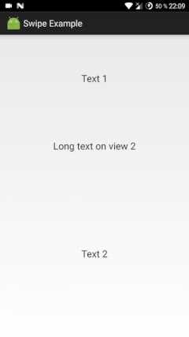

# SwipeLayout
An Android library providing easy swipe switch between two views.

# Demo preview


# Description
This class provides swipe switch between its two child views. Switching is infininite, you can list views to left or right infinitely.
The code is based on [SwipeLayout by Rambler](https://github.com/rambler-digital-solutions/swipe-layout-android).

The library is used in various Android applications by [Chess King](http://play.google.com/store/apps/dev?id=8196632901699712832).

# Setup
- Project's minimum supported version is 9 (tested only on 9+ project, may be reduced to 4).
- Wrap two UI elements inside `com.raistlin.swipelayout.SwipeLayout`.
    ```    
    <com.raistlin.swipelayout.SwipeLayout
        android:id="@+id/activity_actions_layout"
        android:layout_width="match_parent"
        android:layout_height="wrap_content">

        <TextView
            android:layout_width="match_parent"
            android:layout_height="80dp"
            android:layout_gravity="center"
            android:clickable="true"
            android:gravity="center"
            android:text="Long text on view 1"
            android:textSize="20sp" />

        <TextView
            android:layout_width="match_parent"
            android:layout_height="100dp"
            android:layout_gravity="center"
            android:clickable="true"
            android:gravity="center"
            android:text="Long text on view 2"
            android:textSize="20sp" />

    </com.raistlin.swipelayout.SwipeLayout>
    ```
- All done! Give it a try!

# Comments
Your feedback and pull requests are appreciated. Thanks!
